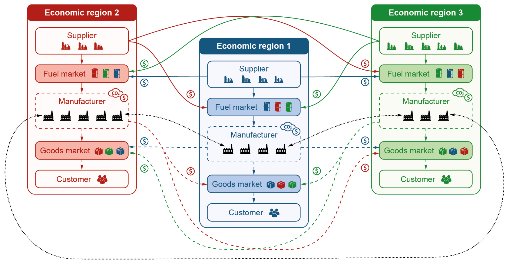

# Modelling carbon tax policies’ impacts across multiple economic regions
 <p align="center">
    <strong>Wen Yi Chan</strong>
    ·
    <strong>Joel Huber</strong>
    ·
    <strong>Gaspard Krief</strong>
    ·
    <strong>Tianyi Liu</strong>
    ·
    <strong>Pascal Troxler</strong>
  </p>
 <p align="center">
    [<a href="MultiRegionPolicy.pdf">Report</a> · <a href="MultiRegionPolicy_slides.pdf">Slides</a> · <a href="https://polybox.ethz.ch/index.php/s/HHGcSP2knsZ4jA5">Data</a>]
</a>
</p>
 <p align="center">
    ETH Zurich, 2022
</p>



## Introduction
An agent-based model to investigate how differing climate
policies amongst countries influence firm-level microeconomic
behaviour.
## Usage

### Colab (recommended)
Run all code directly from our Google Colab notebook. The multi-run experiments and sensitivity analysis need access to your Google Drive in order to store intermediate results.
<a target="_blank" href="https://colab.research.google.com/github/troxlepa/MultiRegionPolicy/blob/main/MultiRegionPolicy.ipynb">
  
</a>

### Local Installation
1. Requirements (will be installed in the notebook)

- Python 3.6+
- AgentPy
- ipywidgets
- tqdm
- SAlib
- matplotlib==3.1.3

2. Follow instruction in the first cell to set up necessary configurations.

## Precomputed Data

If you do not want to re-run the experiments, we provide the precomputed multi-run and sensitivity analysis files <a target="_blank" href="https://polybox.ethz.ch/index.php/s/HHGcSP2knsZ4jA5">here</a>. Unzip the folder and place its subfolders at the project root defined in the topmost cell.

```
├── MultiRegionPolicy
│   ├── data
│   ├── viz
```

Furthermore, set the variable ```USE_PRECOMP_DATA = True``` in the first cell of the notebook.